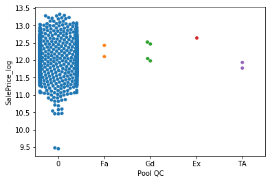
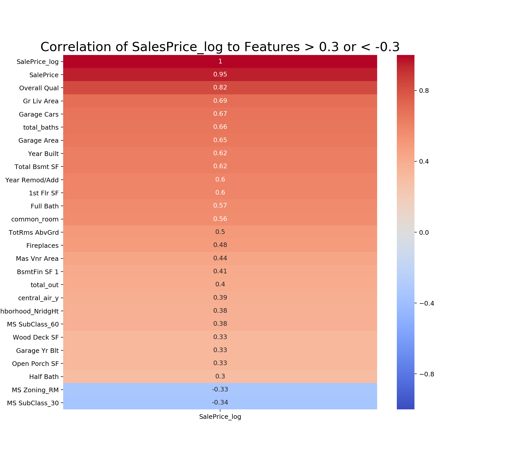
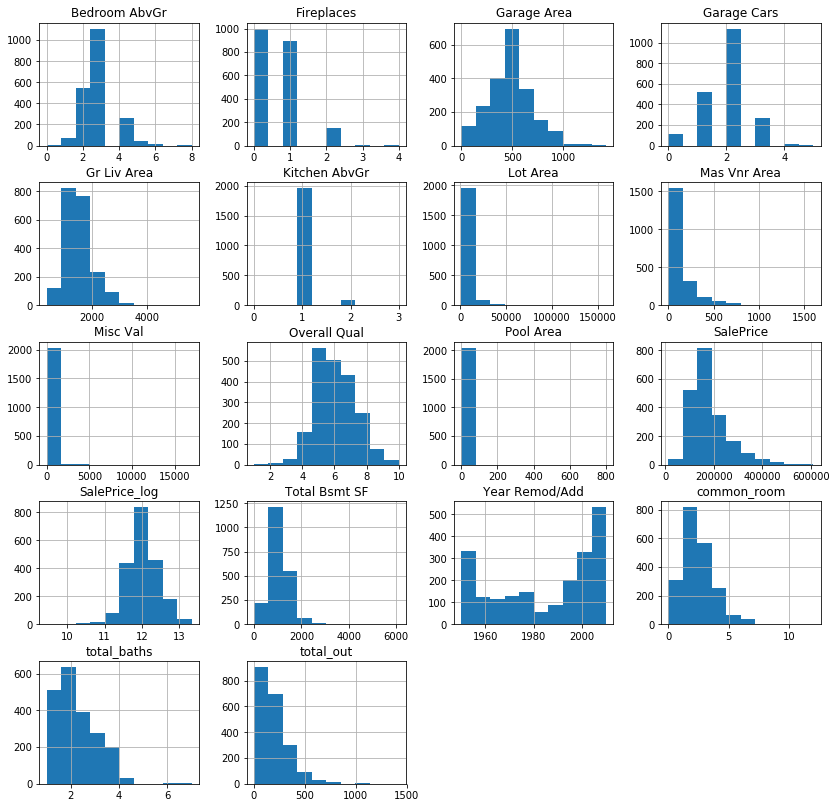
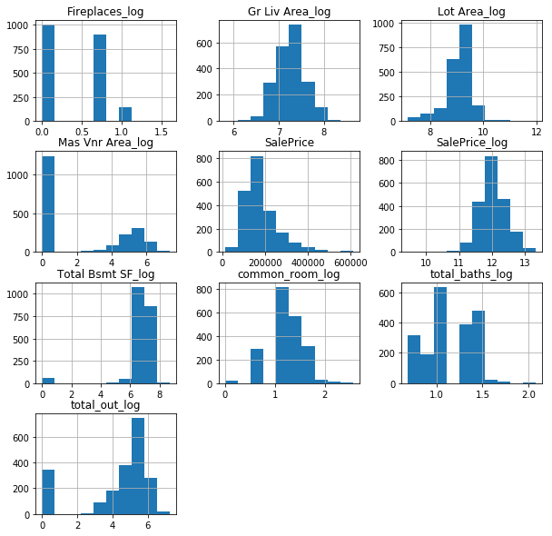
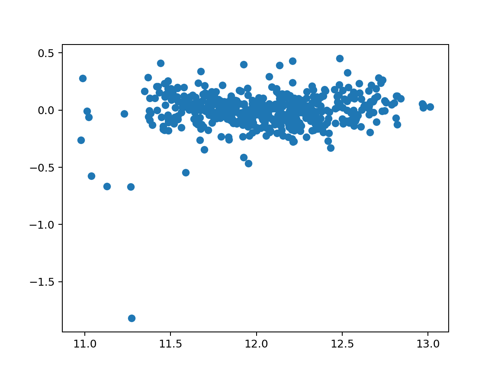
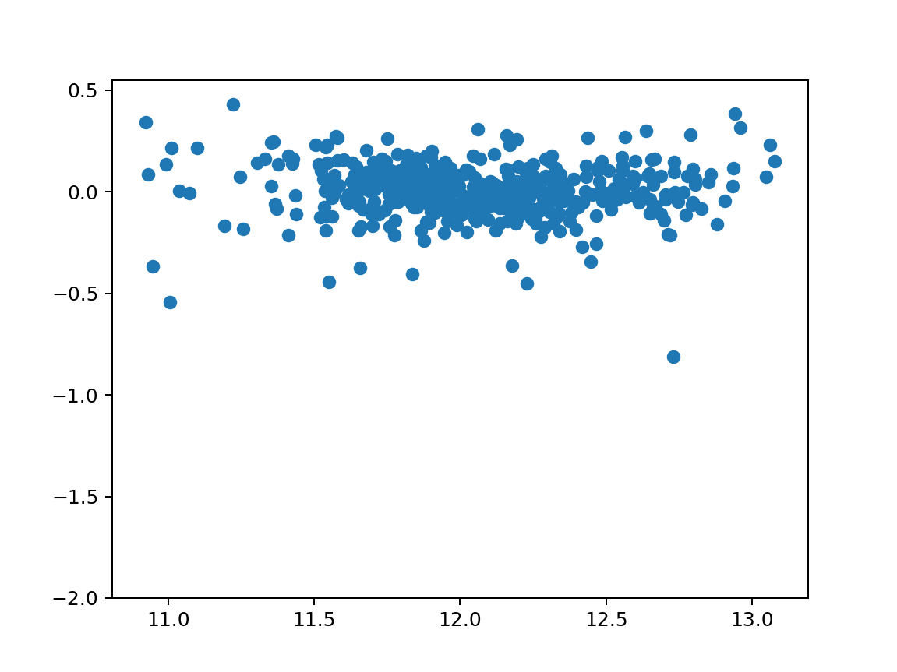

#  Project 2: Ames Housing

## Directory Structure

```
.
├── project_2
    ├── code
        ├── 1_FINAL_Ames_Housing_Analysis_attempt_17_FINAL.ipynb
        ├── Ames_Housing_Analysis_attempt_8 _Poly.ipynb
        ├── Ames_Housing_Analysis_attempt_16_Log_Norm_Hist.ipynb
     ├── data
        ├── 1_FINAL_submission17_lasso
        ├── submission8_lasso.csv
        ├── submission16_lasso.csv
        ├── test.csv
        ├── train.csv
    ├── plots
        ├── Heatmap_SalesPrice_log_Corr.png
        ├── Histogram_Log_Transformed.png
        ├── Histogram_Potential_Log_Targets.png   
        ├── Scatterplot_Attempt_2_Residuals.png
        ├── Scatterplot_Attempt_17_Residuals.png
        ├── Scatterplot_SalePrice_log_by_Gr Liv Area.png   
        ├── Scatterplot_SalePrice_log_by_Lot Area.png
        ├── Swarmplot_MS SubClass.png
        ├── Swarmplot_Pool_QC.png   
    ├── README.md
    ├── Ames_Housing_Data_Dictionary.xlsx
    └── Ames Housing.pdf
```

## Project Outline

Through analysis of Ames housing data of property sales from 2006-2010, this project aims to figure out the key determinants of sale price. A set of train data was provided to develop the model, and a set of test data was provided for the model to predict sale prices. After cleaning the data, doing exploratory data analysis, and selecting a set of features for the model, I was able to generate predictions that minimized the root mean square error. I will present the process of feature selection in the following, as well as summarize key insights  about specific features. From this analysis, I will present a list of features that affect the sale prices of homes.

---

### Description of Data

#### Size

The data consist of 2,051 rows of listings, plus 80 columns of features. Please refer to the Data Dictionary for the complete list of features, as well as descriptions.
       
#### Source

The data was provided for this project by the DSI instructors from Kaggle:

- [test](./datasets/test.csv)
- [train](./datasets/train.csv)

These data files provide all the listings and features for properties sold in Ames, Iowa, from 2006-2010.

You can see the source for the test and train data [here](https://www.kaggle.com/c/dsi-us-8-project-2-regression-challenge/data).

#### Data Dictionary

- [Ames_Housing_Data_Dictionary](./Ames_Housing_Data_Dictionary.xlsx)

#### Data Visualization




**Swarm Plots for Categorical Features**
    
Swarmplots showed how prices clustered around categorical features, as well as show clearly how many data points exist in each category. I've included two examples above, while the bulk of my plots are in the notebook. After review of the plots, it looks like the following will be a good list of features to dummy:

- 'MS Zoning'
- 'Neighborhood'
- 'Land Contour'
- 'MS SubClass'
- 'Functional'

These features all have a good amount of entries (no null values), and the data shows clustering at different price points for different categories within each feature.




**Correlation and Scatter Plots for Numeric Features**
The heatmap and list of correlations of features to 'SalePrice_log' showed that the following list of numeric features would be a good starting point to build the model since they all had a significant correlation number:

- 'Overall Qual'
- 'Gr Liv Area'
- 'Garage Cars'
- 'total_baths'
- 'Year Remod/Add'
- 'Total Bsmt SF'
- 'common_room'
- 'Fireplaces'
- 'total_out'
- 'Lot Area'




**Histograms for Log Features**
The histogram plots of the distribution of data for the numeric features indicated which ones may be a good candidate for log transformations. The second set of histograms show how the log transformed features became normally distributed:

- 'Gr Liv Area_log'
- 'Total Bsmt SF_log'
- 'Mas Vnr Area_log'
- 'Lot Area_log'
- 'total_out_log'

I used these log transformed features in the place of their counterparts for some of my attempts.




**Residuals**
The scatter plots of predictions and residuals look evenly distributed, with a few outliers. Doesn't appear to be a pattern, so homoscedastic. The residuals distribution tighten up around 0 from earlier models to the final model.

---

### Model Development

#### Feature Selection

The feature list includes all the numeric and categorical features I selected for my final submission to Kaggle. Additional features were used for other iterations to see how they would affect the model.

- 'Overall Qual'
- 'Gr Liv Area'
- 'Garage Cars'
- 'total_baths' 
- 'Year Remod/Add' 
- 'Total Bsmt SF'
- 'common_room' 
- 'total_out'
- 'Lot Area'
- 'Fireplaces'
- 'Pool Area'
- 'Bedroom AbvGr'
- 'Kitchen AbvGr'
- 'Misc Val'
- 'Mas Vnr Area'
- 'Garage Area'
- 'Garage Yr Blt'
- 'Lot Frontage'
- 'MS Zoning'
- 'street_paved'
- 'central_air_y'
- 'Neighborhood'
- 'Land Contour'
- 'MS SubClass'
- 'Functional'
       
#### Model Creation and Score

The features were scaled before running them through all three models (Linear Regression, Lasso, and Ridge). I also calculated the scores for each model so that I may pick the best fit. The Linear Regression model never worked for me, so it's an item I'll have to investigate. 90% of the time I used a Lasso model as opposed to Ridge as it generated the best score. I tried submitting a Lasso model and Ridge model with the same feature set into Kaggle, and there was a negligible score variance between the two. For the most part I saw model and cross-val scores around 0.84 all the way up to 0.90 through all the different model iterations. The root mean squared dropped from around 0.15 to 0.13 from earlier models to the final model. Fitting the model on the entire train dataset helped create better predictions for the test data.

---

## Conclusion

#### There are a lot of features that go into determining the price! Steps to select the best set of features:

- Evaluate how much data is within each feature
- Use boxplots or swarmplots to see how price clusters around categorical features
- Refer to correlation to narrow down the list of numeric features
- Don’t include features that overlap
- Think like a buyer!

#### Features that increase house values:

- Overall quality and fit
- Total house square footage
- Number of bathrooms, bedrooms, common rooms
- Garage size/number of cars it can fit
- Fireplaces
- Central air conditioning

#### Features to avoid:

- Houses older than 1945
- Residential zones of medium density
- Enclosed porches

#### 3 Neighborhoods that have higher house values:

- Northridge Heights
- Northridge
- Stone Brook

#### 3 Neighborhoods that have lower house values:

- Iowa DOT and Rail Road
- Old Town
- Edwards

### Next Steps
- Add model to predict values for features with lots of null values or zeros where there shouldn't be
- Try converting ordinal features to a numeric scale
- Drop outliers mentioned in the Data Dictionary from Kaggle
- Use p-value to evaluate features

---

Outside References:

- https://en.wikipedia.org/wiki/Ames,_Iowa
- https://money.cnn.com/magazines/moneymag/bplive/2010/snapshots/PL1901855.html

